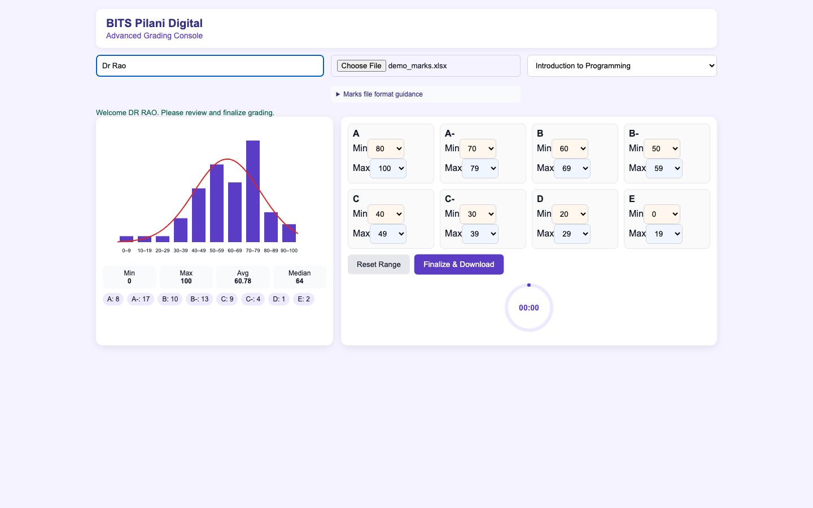
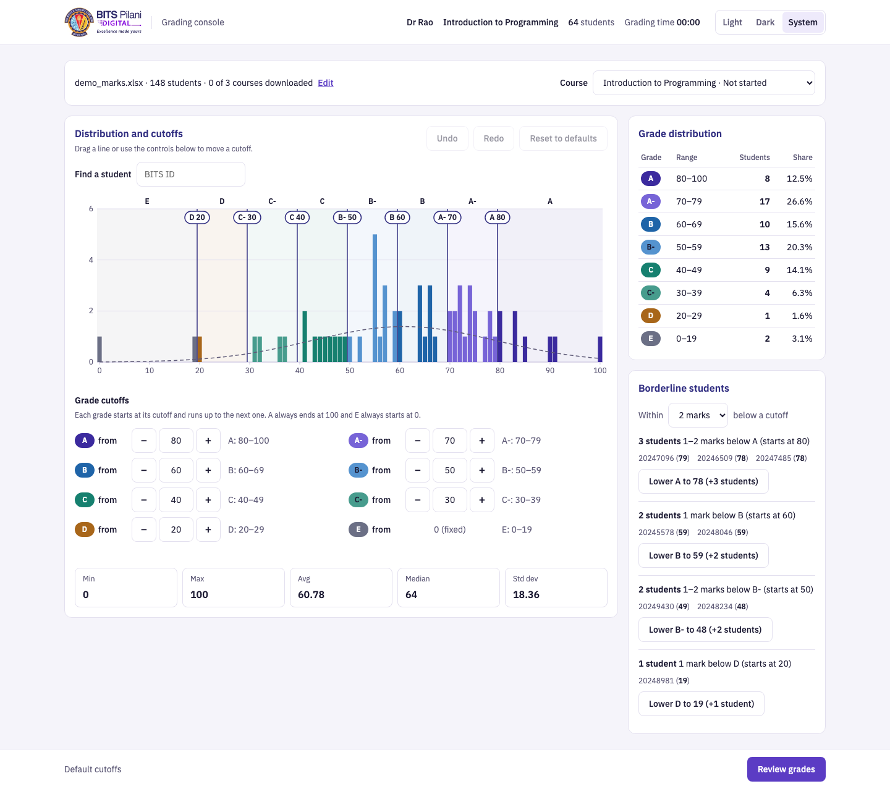
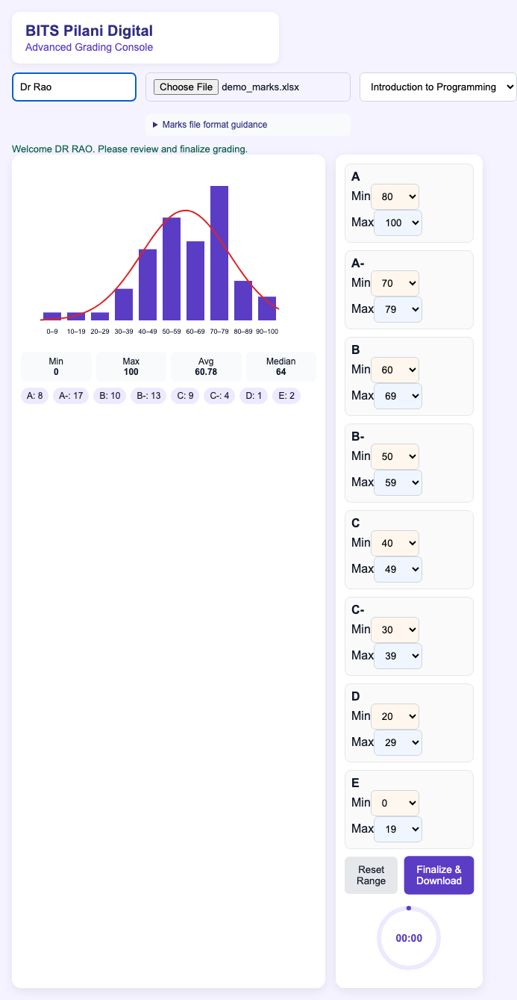
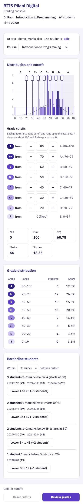
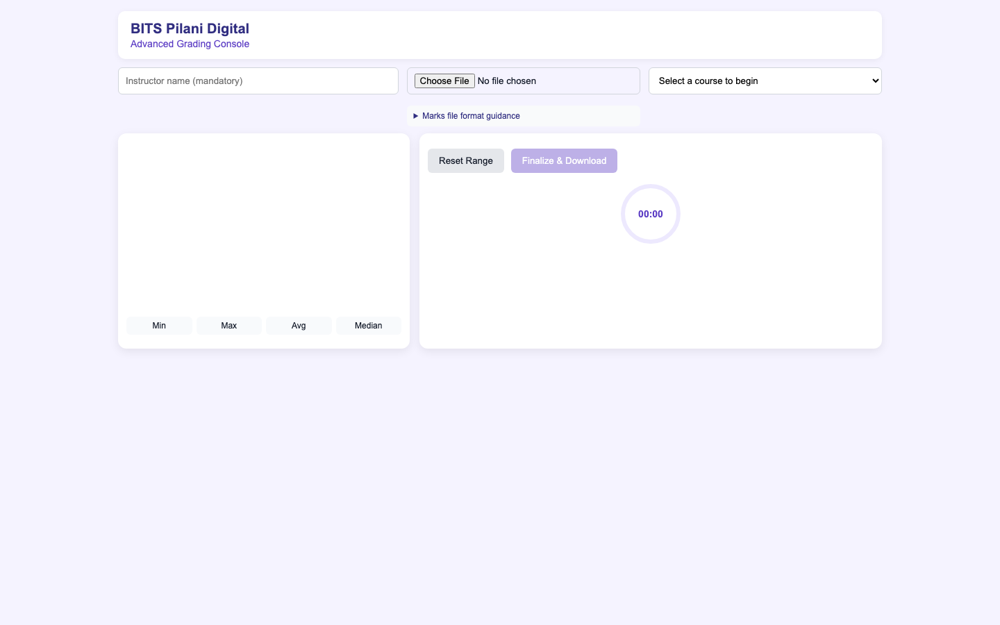
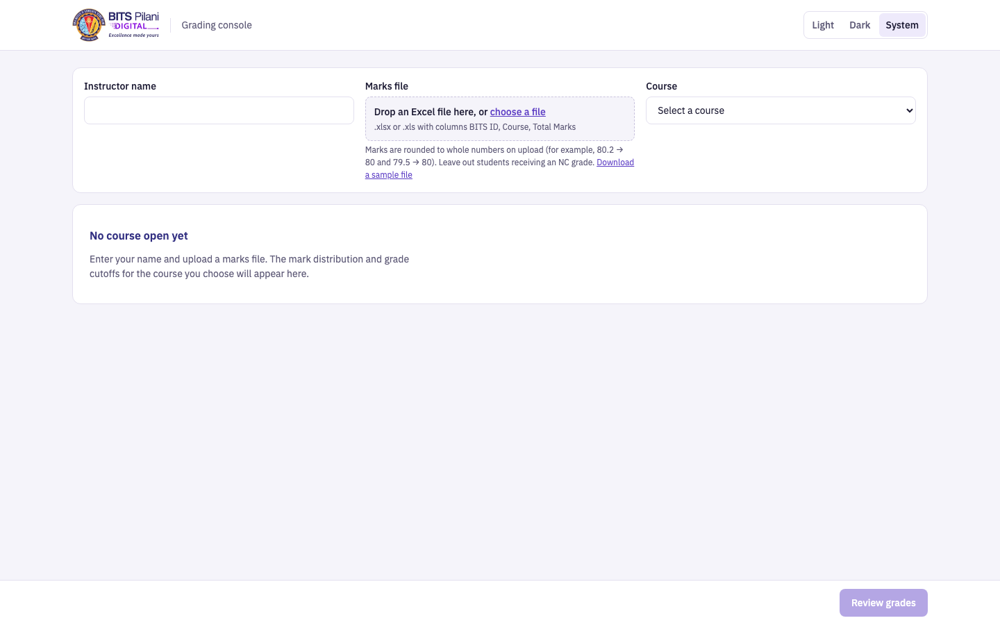

# Stage 2 Enhancements

Every enhancement answers one question an instructor has while deciding cutoffs at
the end of a trimester:

| # | Instructor's question | Enhancement |
|---|---|---|
| E1 | "How do I set cutoffs without breaking the ranges?" | A cutoff editor that can't produce invalid ranges |
| E2 | "Where do my cutoffs fall on this class's distribution?" | The histogram becomes the control surface |
| E3 | "Which students does moving a cutoff by one mark actually affect?" | Borderline students |
| E4 | "Am I sure about what I'm about to submit?" | Review before export |

All grade calculations go through one function, `gradeFor(mark)`. The counts, the
distribution table, the chart, the borderline list and the CSV export can't
disagree. The CSV format is frozen: byte-for-byte golden tests compare the export
with what the Stage 1 app produced (`tests/golden/`).

---

## E1: A cutoff editor that can't produce invalid ranges

**Problem.** Stage 1 showed 16 dropdowns with 101 options each, a Min and a Max for
every grade, even though continuous bands are fully described by 7 numbers. That
made it easy to create a gap or an overlap and then be told off with an error.
Changing one grade meant checking its neighbours by hand. The instructor was doing
bookkeeping instead of deciding where the cutoffs should be.

**Solution.**
- **Seven cutoff controls:** "A from" … "D from". Each is a labelled number input
  with − / + buttons, the arrow keys, and typing. E always starts at 0 and A always
  ends at 100, shown as fixed text.
- **Derived ranges:** each band's range (e.g. "A-: 70–79") is shown read-only
  beside its control and updates live.
- **Constraints:** every cutoff is kept between the next-lower cutoff + 1 and the
  next-higher cutoff − 1 (and between 1 and 100), so every band keeps at least one
  mark. Arrow keys and valid typing apply immediately. An out-of-range value is
  clamped when the field loses focus, and an inline note says what happened ("A-
  must start between 61 and 79, so it was set to 79."). The −/+ buttons disable at
  their limits. Because an invalid configuration can't be reached, the old
  range-error message path is gone.
- **One source of truth:** a single `cutoffs` object, with `gradeFor(mark)`,
  `bandRange(g)` and `setCutoff(g, v)` (the only way cutoffs change) deriving
  everything else.
- **Distribution table:** the side panel shows every grade's range, student count
  and share, with each grade's ramp colour.
- **Reset and change counter:** "Reset cutoffs" restores the defaults after one
  confirmation, and is disabled when nothing differs from the defaults or no course
  is open. The action bar says how many cutoffs differ from the defaults.
- **Announcements, not animation:** grade-count changes are announced to screen
  readers through an `aria-live` region ("Grade counts changed: A from 5 to 4, A-
  from 2 to 3."). This replaces the Stage 1 card "lift" and chip "pulse"
  animations, which the design system rules out.

**Why this beats the obvious alternative.** The obvious fix would be to keep the
Min/Max dropdowns and improve the validation messages. But that still lets the
instructor build a broken configuration, then makes them repair it. With one
number per boundary, a gap or overlap simply can't be expressed. The instructor
only ever answers the real question ("where does A start?"), and everything else
follows from it.

**How it was tested.**
- `E1:` tests in `tests/grading.spec.js` cover the default derived ranges,
  clamping with the note, restoring an emptied field, arrow-key stepping that
  applies immediately, −/+ limits, and the change counter.
- A golden test sets A 78 / B- 52 through the new controls and checks that the
  CSV is byte-identical to the Stage 1 export for the same cutoffs.
- The ground-truth test (demo file, Introduction to Programming: Min 0, Max 100,
  Avg 60.78, Median 64, A 8 · A- 17 · B 10 · B- 13 · C 9 · C- 4 · D 1 · E 2) still
  passes.

---

## E2: The histogram becomes the control surface

**Problem.** The chart and the cutoffs lived in separate panels, and the chart
grouped marks into 10-mark bins. The instructor couldn't see where a cutoff fell
on the distribution, and the bins hid exactly the detail that matters: a 10-mark
bin can't show whether the students near 80 are at 79 or at 71.

**Solution.**
- **One bar per mark:** an inline SVG histogram with one bar per mark (0–100), so
  a 79/80 boundary is exact. Each bar is coloured by the grade that mark currently
  receives (the grade ramp, via `gradeFor`).
- **Axes:** integer y-ticks with faint gridlines, and x-ticks every 10 marks.
- **Bands:** each grade band is shaded with a very light tint, with its letter
  at the top.
- **Draggable cutoffs:** every cutoff is a vertical line with a draggable handle
  (pointer events, snapping to whole marks). A drag goes through the same
  `setCutoff()` as the inputs, so it obeys the E1 limits and updates the counts,
  colours and ranges live. The handles are `aria-hidden`; the E1 inputs are the
  keyboard route to the same action.
- **Tooltips:** hovering a mark shows e.g. "79 marks: 1 student (A-)". The chart
  is one tab stop; ←/→ (and Home/End/PageUp/PageDown) move between marks and
  show the same tooltip, announced through `role="status"`.
- **Bell curve:** dashed `--ink-muted`, drawn as expected students per mark
  (n × pdf) through the bar centres, on a y-scale shared with the bars. The
  scale is max(tallest bar, curve peak), keeping the #26 fix. The curve is
  skipped when std = 0.
- **Stats and screen-reader text:** the stats row adds Std dev (population,
  matching the curve), and a visually hidden text summary gives screen-reader
  users the distribution and per-grade counts.
- **Implementation:** the chart is built once per course (and on resize).
  Cutoff changes only move and recolour existing elements, so a handle is never
  destroyed mid-drag, and the bars grow once when a course opens (reduced motion
  respected).

**Why this beats the obvious alternative.** The obvious step is to keep a static
chart and draw the cutoff lines on it. That answers "where do my cutoffs fall",
but the instructor still has to look back and forth between the chart and a
form. Making the lines draggable puts the decision where the evidence is. Per-mark
bars mean a one-mark move visibly changes which bars take which colour.

**How it was tested.**
- `E2:` tests cover the following.
  - Bar colours: they follow a cutoff move (mark 79 turns from A- to A).
  - Dragging: dragging the A handle to 78 changes the cutoff and the A count
    (checked against the fixture). Dragging A- past A stops at 79, and dragging D
    to 0 stops at 1.
  - Tooltips: the text is correct on hover and when read by keyboard.
  - The handles are aria-hidden.
  - Std dev and the hidden summary are correct.
- The Stage 1 chart tests were rewritten for the SVG (see below). A mutation
  check confirmed the clustered-marks test fails without the shared-scale fix.
- **UX bug found by testing:** the first version gave each handle a 20px
  invisible grab strip. That swallowed hover on the bars on either side of every
  cutoff, which are the marks an instructor most wants to inspect. The strip is
  now 6px and the knob is the main grab target.

---

### Stage 2B follow-up: handles you can read

**Problem (from review).** The handles were bare lines with a small knob. You had to look at the
controls below to know which cutoff a line was and what value it had. Nothing told you the
lines could be dragged at all.

**Solution.**
- Each knob is now a pill labelled with its grade and value ("A 80"). The label updates live
  during a drag.
- Hovering or dragging makes the line and pill accent-coloured (a filled pill with white text).
  The cursor is `ew-resize`.
- Where two pills would touch (cutoffs close together, or a 390px screen), the later one drops
  to a second row. Labels never cover each other, and pills stay inside the plot at 0 and 100.
- A line of helper text under the panel title: "Drag a line or use the controls below to move a
  cutoff."

**How tested.** `E2+` tests:
- The labels read `A 80 … D 20` and follow a typed cutoff.
- During a mouse drag (button still down) the label reads the new value and the handle has its
  active state.
- Pill bounding boxes never overlap at 1440px or 390px, including with A- moved right next to A.

Screenshots checked at 1440 and 390.

### Stage 2B follow-up: where the default was

**Problem.** Once a line has been dragged, the chart no longer shows where it started, so
there's no way to see how far you've moved from the institute's defaults.

**Solution.** When a cutoff differs from its default, a faint dashed line (muted ink, 60%
opacity) marks the default position. Hovering it shows "default 80". It sits above the
tooltip columns so it can be hovered, and below the handles so it never blocks a drag. It
disappears once the cutoff is back at its default.

**How tested.** `E2+` default-marker test:
- All 7 markers are hidden at the defaults.
- Moving A to 78 shows only A's marker, drawn at the left edge of mark 80.
- Its label is invisible until hovered, then reads "default 80".
- Typing 80 again hides it.

## E3: Borderline students

**Problem.** The real grading decision is rarely "is 80 the right number". It's
"what about the three students on 78 and 79?". Those students were invisible. To
find them, an instructor had to sort the spreadsheet by hand and cross-check
every cutoff.

**Solution.**
- **Borderline panel:** for each cutoff, lists the students within N marks below
  it (N = 1, 2 or 3; default 2), with their BITS ID and mark, e.g. "3 students
  1–2 marks below A (starts at 80): 20247096 (79), 20246509 (78), 20247485 (78)".
- **Adjacent grade only:** a group only includes students in the grade
  immediately below that cutoff. A student can't appear in two groups, and a
  group can never contain a whole neighbouring band.
- **Empty groups hidden:** cutoffs with nobody near are hidden. If there are none
  at all, the panel says so ("No students are within 2 marks below any cutoff.").
- **One action per group:** "Lower A to 78 (+3 students)". It moves the cutoff to
  the lowest listed mark through `setCutoff()`, so everything updates at once. It
  is disabled, with a reason linked by `aria-describedby`, when it would leave
  the next grade down with no marks ("A- starts at 79, so A can't move down to
  79.").
- **Linked highlight:** hovering a student dims every other bar in the histogram,
  so theirs stands out.
- **Decision (confirmed):** the action lowers the cutoff to the lowest listed
  mark, so everyone listed moves up. That is one button per cutoff, not one per
  mark.

**Why this beats the obvious alternative.** The obvious alternative is a
sortable student table. It holds the same data, but the instructor would have to
work out which rows matter and what to do about them. The panel answers the
actual question ("who is one mark away, and what happens if I include them?").
It also turns the answer into a single, bounded, reversible action.

**How it was tested.**
- `E3:` tests compare the listed students per cutoff with an independent
  calculation from the demo file (N = 2, then N = 1 and 3), and check that
  cutoffs with nobody near are hidden.
- The action is tested to move the cutoff and the counts (A 8 → 11, A- 17 → 14).
  After the move, the next students below A take the group's place.
- The disabled case (A- at 79) is tested, with its reason text and
  `aria-describedby`.
- Hovering a student highlights exactly their bar.
- The empty state is tested on `identical_marks.xlsx`.

---

## E4: Review before export

**Problem.** "Finalize & Download" committed every student's grade with one
blind click. The instructor never saw a final summary of what they were about to
submit: how many students got each grade, which cutoffs they had moved from the
defaults, or whether anyone was still sitting one mark below a boundary.

**Solution.**
- **Review first:** the action bar's primary button is now "Review grades". It
  opens a native `<dialog>` (`showModal()`), so it is modal, Esc closes it, and
  focus returns to the button afterwards. It is the only element in the app with
  a shadow.
- **What the dialog shows:**
  - course, instructor and student count;
  - each grade's range, count and share;
  - every cutoff changed from its default ("A: 80 to 78"), or "None. All cutoffs
    are at their defaults.";
  - the number of borderline students still just below a cutoff, stated as
    information ("You can still adjust the cutoffs before downloading"), not as
    a blocker.
- **Download:** "Download grades (CSV)" runs the unchanged Stage 1 export (same
  header block, columns, labels, BOM, formula guard and filename). It then closes
  the dialog and shows the per-course completion message.
- **Going back:** "Back to grading" closes the dialog and changes nothing.
- **Name check:** the instructor-name check from #15 now happens when the dialog
  is opened, with the same inline message style.

**Why this beats the obvious alternative.** The obvious alternative is a
`confirm("Download grades?")` box. That adds a click but no information, and
people learn to dismiss it without reading. The review shows the few facts that
actually change the decision: the distribution, what was changed, and who is
still on a boundary. It doesn't block the download on any of them.

**How it was tested.**
- `E4:` tests check that the dialog's course, instructor, count, per-grade table
  (equal to the side panel), changed-cutoff list and borderline count match the
  live state, and that the no-changes case is handled.
- Esc and "Back to grading" each close the dialog with the cutoffs, counts and
  completion message untouched, no download, and focus back on "Review grades".
  The next download still counts as the first attempt.
- A download closes the dialog, and a second download says "second attempt" with
  identical bytes.
- **Byte-identity:** all four golden CSVs (three courses with default cutoffs,
  plus A 78 / B- 52) are now downloaded through the dialog and still match the
  Stage 1 exports byte for byte.

---

## Visual redesign

The four enhancements sit on a new foundation built to the CLAUDE.md design
system. The feel is a calm, institutional mark sheet, and the one bold element
is the histogram with its grade bands.

- **Layout.** An app bar (the BITS Pilani Digital logo and "Grading console",
  plus instructor · course · class size · timer once grading starts) sits above
  a setup panel. The setup panel collapses to a
  one-line summary with "Edit" once a course is open, keeping the course switcher
  visible. The workspace is the chart, cutoff editor and stats on the left, with
  the grade distribution and borderline students on the right. It stacks into
  one column below 1024px and works at 360px. A sticky action bar holds the
  change counter, "Reset cutoffs" and "Review grades".
- **Visual system.**
  - Colour tokens on `:root`, including a one-hue grade ramp (A darkest to E
    lightest) used for bars, bands and chips. White text sits on the four
    darkest steps and ink on the rest, and every step passes WCAG AA (tested).
  - IBM Plex Sans with a system-font fallback, and tabular numbers.
  - An 8px spacing grid; 1px-bordered panels with no shadows; 40px controls.
    The only shadow is on the review dialog.
- **Setup.**
  - Every input has a visible label.
  - A drop zone wraps the real file input (click, or drag and drop), shows the
    file name and student count once parsed, and carries the format guidance
    and a "Download a sample file" link.
  - The name is kept exactly as typed.
- **Empty and error states.** Before a course is open, the analysis area says
  what to do next. Upload errors keep their row-level messages, shown in a
  `--danger` callout. `alert()` is gone: choosing a course without a name gives
  an inline prompt and moves focus to the name field.
- **Logo.** `assets/logo.png` is trimmed and scaled to 2× its 48px display
  height by `scripts/make-logo.mjs`, then inlined as a ~10 KB WebP data URI.
  The app stays a single self-contained `index.html`. The logo is the page's
  `<h1>`, with `alt="BITS Pilani Digital"`. The browser tab uses the seal alone
  as a 64px favicon on a transparent background (the full lockup is unreadable
  at tab size), also inlined. Its seal keeps its own brand colours;
  the "nothing else is ever red" rule applies to UI colour, not to the logo.
- **Motion.** The bars grow once when a course opens, and the dialog fades in.
  Nothing else animates (no hover lifts, no pulsing chips), and
  `prefers-reduced-motion` disables both.
- **Polish pass ("remove one accessory").**
  - The welcome line ("Welcome, Dr Rao. Review the cutoffs…") repeated the name
    already in the app bar and setup summary and didn't help anyone decide, so
    it was cut.
  - Screenshot review also led to:
    - lighter band tints;
    - outlines on the two palest ramp steps so their bars stay visible;
    - dimming the other bars when a borderline student is hovered (a dark bar's
      outline was invisible);
    - an adaptive cutoff-editor grid (it overflowed at 1024px);
    - stacked dialog buttons on phones (a label wrapped inside a 40px button).
- **Keyboard and screen readers.**
  - A keyboard-only walkthrough goes from name entry to a downloaded CSV, and
    runs as a test.
  - The −/+ stepper buttons are out of the tab order, because ↑/↓ in the input
    does the same. That cuts the editor from 21 tab stops to 7.
  - Errors are `role="alert"`; the completion message and chart tooltip are
    `role="status"`; count changes and clamp notes are `aria-live`.
  - Every control has a visible `:focus-visible` ring.

| | Before (Stage 1) | After (Stage 2) |
|---|---|---|
| Desktop, course open |  |  |
| Phone, course open |  |  |
| Empty state |  |  |

All seven states (empty, upload error, loaded, cutoff moved, borderline, dialog
open, downloaded) at 1440, 1024 and 390px are in `docs/screenshots/after/`. They
are regenerated with
`SHOTS_OUT=docs/screenshots/after npx playwright test -c playwright.screenshots.config.js scripts/screenshots.spec.js`.

---

## Stage 1 tests rewritten in Stage 2

When a Stage 2 change legitimately made a Stage 1 test obsolete, the test was
rewritten to check the same guarantee through the new UI. None was deleted.

| Test | Why it changed | What it checks now |
|---|---|---|
| #23b (no-instructor prompt) | `alert()` is banned by CLAUDE.md, so the prompt became inline (`fix:` commit). | No dialog. The inline message appears, focus moves to the name field, and typing clears it. The previous course is still cleared. |
| #15, #23b, #27b (retype the name mid-flow) | Setup collapses once a course is open, which hides the name field. | They click "Edit" first (`setInstructor` helper). Assertions unchanged. |
| Happy path (welcome text) | The welcome text no longer upper-cases the name. Later, the polish pass cut the welcome line. | The name is shown as typed (`Dr Rao`) in the app bar. |
| #2, #23a (welcome cleared on reset) | The welcome line was cut in the polish pass. | The same guarantee, "no per-course context survives a reset", checked as the app-bar context being hidden. |
| #12 curve tests (stub context) | The curve became dashed, so the stub needs `setLineDash`. | Unchanged assertions. The stub gained a no-op `setLineDash`. |
| #8 ×2 (A ends at 100, E starts at 0) | E1 removed the Min/Max selects. | Typing A 150 clamps to 100 (A: 100–100), and nobody is dropped from the export. E has no input, and D can't go below 1 (E: 0–0). |
| #9 (single-mark band) | E1 | A from 100 gives A: 100–100 with no clamp note, and the export grades 100 as A and 80 as A-. |
| #10 ×2 (cascades) | E1: one number per boundary, so no cascade code. | Changing a cutoff updates both neighbouring derived ranges. |
| #16 (lift/pulse timing) | The design system forbids hover lifts and pulsing chips. | A count change is announced once via `aria-live`, and a change that moves nobody leaves the announcement alone. |
| #17 (no pulse on course switch) | As #16. | Switching course leaves the live region empty (no spurious announcement). |
| #19 ×2 (reset confirms once) | E1 | The same guarantees through "Reset cutoffs" and the cutoff inputs. |
| #22 (reset before a course) | E1: the button is now disabled until there is something to reset. | Disabled on a fresh page and after upload. A forced click causes no error and no dialog. |
| Happy path (adjust a range) | E1 | The cutoff is adjusted with the new input. Counts are read from the distribution table. |
| #2 (canvas blank after re-upload) | E2 replaced the canvas with SVG. | The SVG chart is empty after a re-upload. |
| #12 ×6 (canvas histogram) | E2: SVG, one bar per mark. | Bars stay inside the plot and use the space. The x-axis is labelled every 10 (it was "0–9 … 90–100" bins). The curve passes through the bar centres and equals n × pdf for 1-mark bins (it was n × 10 × pdf for 10-mark bins). No curve and no NaN when std = 0. A re-upload during the opening animation leaves no stale chart. |
| #26 ×2 (clustered curve) | E2 | The curve's highest point stays inside the plot area (read from the SVG path instead of recorded canvas calls). |
| `download()` helper (used by most CSV tests) | E4: downloads go through the review dialog. | Opens the dialog and clicks "Download grades (CSV)". Every CSV assertion is unchanged. |
| #2, #8, #9, #23 ×2, happy path (Download enabled/disabled) | E4: the gate is now "Review grades". Left on `#download`, these would have passed vacuously, because that button now lives in a closed dialog. | The same enabled/disabled guarantees on `#reviewBtn`. |
| #15 (export blocked without a name) | E4 | The block happens when opening the review: inline message, no dialog, no download. |
| #18 (ordinals) | E4 | 23 finalizes through the dialog. |
| #27b (blocked export clears on re-upload) | E4 | The blocked attempt clicks "Review grades". |
| setup: collapses to a summary (summary text) | Stage 2B, #33: the summary no longer repeats the instructor, who is shown in the app bar. | The summary reads `demo_marks.xlsx · 148 students · 3 courses`. Collapse, Edit and focus are checked as before. |
