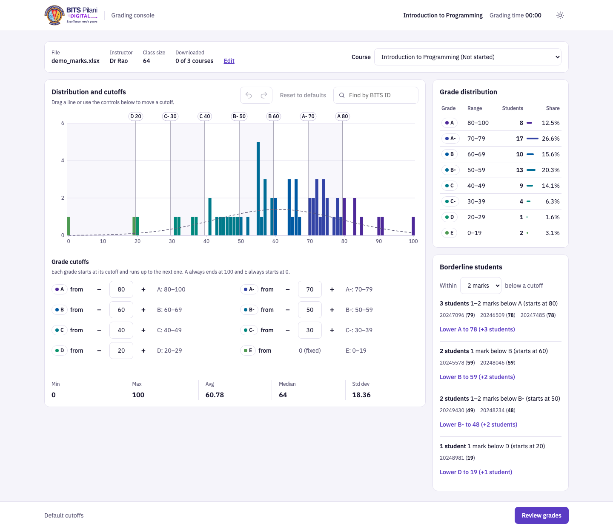
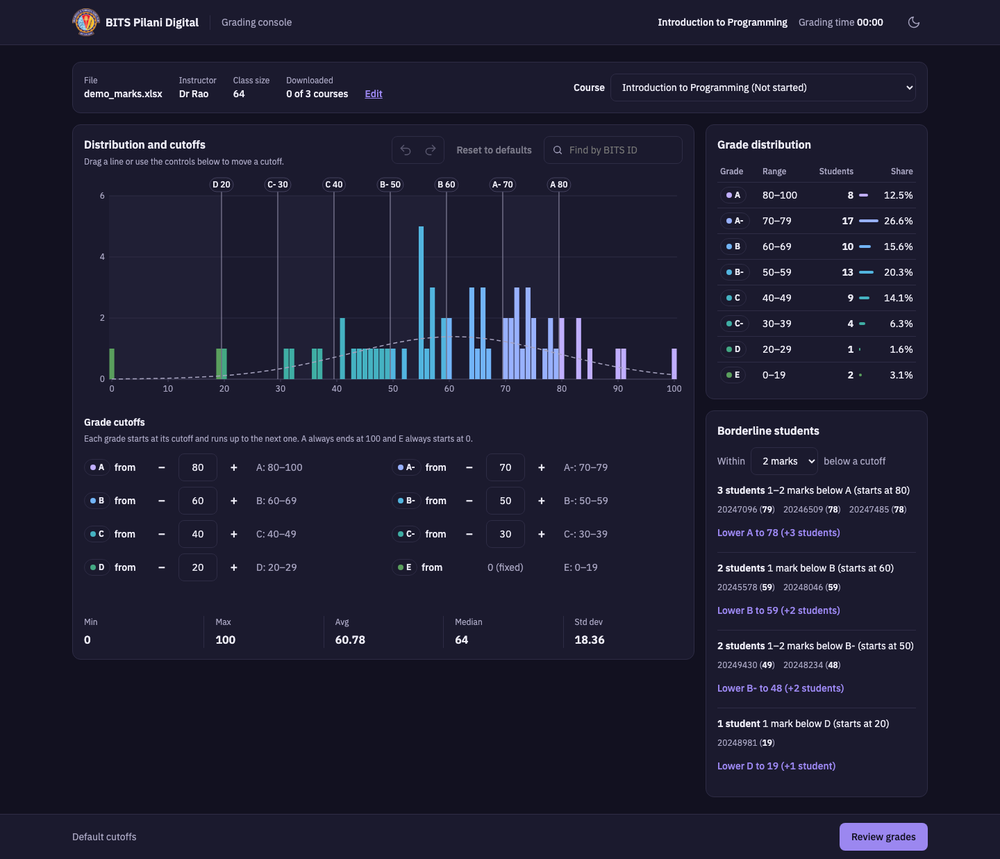

# Grading console

A grading console for instructors: upload a class's marks, set fair grade
cutoffs on the distribution, and download final grades. It was rebuilt from a
deliberately buggy prototype for the BITS Digital CodeForge V1.0 challenge. It
is not an official BITS tool.

**Live app:** https://computertech99.github.io/bits-challenge/

You don't need your own data. The upload area has a link to download a sample
marks file (3 courses, 148 students).




## What changed

### Debug
I fixed the 30 bugs in the original app (#1–#30), plus 19 more issues found in
hands-on reviews of my own changes (#31–#52; #47–#49 are styling, logged in
ENHANCEMENTS.md). Every fix is covered by a test. The most consequential:
- **Students silently disappeared.** A decimal mark, or ranges that left a gap
  in 0–100, meant a student got no grade and was left out of the export
  (#7, #8). Every student now gets exactly one grade.
- **Duplicate BITS IDs were graded twice** (#28). Now they are rejected with
  the row numbers.
- **The CSV could run formulas.** A value starting with `=`, `+`, `-` or `@`
  ran as a formula when opened in Excel (#29). It is now escaped.

Every bug, with repro, cause, fix and test: [BUG_FIX_LOG.md](BUG_FIX_LOG.md).

### Reimagine
Each change starts from a problem an instructor actually has:
- **E1 Cutoff editor.** Sixteen Min/Max dropdowns made it easy to leave
  gaps and overlaps. Now there is one "from" value per grade, and the ranges
  can't become invalid.
- **E2 Chart with cutoffs.** Cutoffs used to be set blind, away from the
  data. Now you drag them on the histogram, and each bar takes its grade's
  colour as you go.
- **E3 Borderline students.** The students one mark short of a grade were
  hard to find. Now they are listed per cutoff, with a one-click "Lower A to
  79 (+1 student)".
- **E4 Review before export.** One click used to download final grades. Now
  a review shows the counts, the changed cutoffs, and anyone still on a
  boundary first.
- **E9 Impact of changes.** "Which students did my change affect?" had no
  answer. Now the review lists exactly whose grade differs from the defaults.

Supporting improvements: undo and redo (E5), per-course progress and autosave
(E6), find a student by BITS ID (E7), and dark mode (E8). Problem, solution and
tests for each: [ENHANCEMENTS.md](ENHANCEMENTS.md).

### Deploy
A static single-file app (`index.html`) on GitHub Pages: no build step, no
server. SheetJS is pinned to 0.18.5 on a CDN, with a vendored copy as fallback.

## Privacy
Marks never leave the browser: nothing is uploaded anywhere. To survive a
refresh, the app saves only each course's cutoffs and download status, plus
your theme, in `localStorage`. It never stores marks or BITS IDs. If the
browser blocks storage, the app works the same but doesn't remember.

## Run locally
```sh
npx serve .
```
Opening `index.html` directly also works.

Tests (Node is only needed for the dev tooling):
```sh
npm ci
npx playwright install
npx playwright test          # full suite: Chromium, WebKit and Firefox
```

Results on the final commit (`tests/live-smoke.spec.js` is skipped unless `LIVE=1`):

| Browser  | Full suite             | Live smoke (GitHub Pages) | Where                    |
|----------|------------------------|---------------------------|--------------------------|
| Chromium | 192 passed             | passed                    | macOS and GitHub Actions |
| WebKit   | 190 passed, 2 skipped¹ | passed                    | macOS and GitHub Actions |
| Firefox  | 190 passed, 2 skipped¹ | passed                    | GitHub Actions (Ubuntu)  |

¹ The two touch-drag tests need the Chrome DevTools Protocol, so they only
run in Chromium.

The live smoke test downloads the sample file through the in-app link,
uploads it, checks the statistics and grade counts, moves A to 78, reviews,
and compares the downloaded CSV line by line with the expected file:
```sh
LIVE=1 npx playwright test tests/live-smoke.spec.js
```

CI runs the suite in all three browsers on every push to `main`
([workflow](.github/workflows/test.yml)); the live smoke test runs from the
same workflow on demand. Screenshots of the live site: [docs/screenshots/live/](docs/screenshots/live/).

## Project structure
```
index.html              the app (the only file that ships)
assets/                 logo, OG image, vendored SheetJS fallback
fixtures/               .xlsx test files, their generator, demo_marks.xlsx
tests/                  Playwright suite, golden CSVs, live smoke test
.github/workflows/      CI (three browsers) and the Pages deploy
scripts/                screenshot and logo tooling (dev only)
docs/screenshots/       before/after, final and live screenshots
original/               the untouched challenge source
BUG_FIX_LOG.md          every bug: repro, cause, fix, test
ENHANCEMENTS.md         Stage 2: problem, solution, how tested
AI_USAGE.md             how AI tools were used
```

## Known limitations
These were considered and deliberately left as they are.

- **The dark colour tokens are declared twice**: once under
  `:root[data-theme="dark"]` (the Dark choice) and once under
  `@media (prefers-color-scheme: dark)` (System). Plain CSS can't share one
  block between the two without a build step. A test checks that the two
  blocks are identical.
- **Undo history doesn't survive a refresh.** Cutoffs and download status do.
  Undo is for changes within a session.
- **The longest course status is cut off on a phone.** At 390px, "Introduction
  to Programming (Changed since download)" is wider than the course select.
  The native option list shows it in full.
- **Firefox is tested on CI, not on the development Mac.** Playwright 1.63's
  Firefox build doesn't launch on macOS 27, so Firefox runs on GitHub Actions
  (Ubuntu), where the full suite and the live smoke test pass (#51). This
  affects testing only; nothing in the app differs in Firefox.

## AI use
This project was built with Claude Code. What it did and what I reviewed is
in [AI_USAGE.md](AI_USAGE.md).
